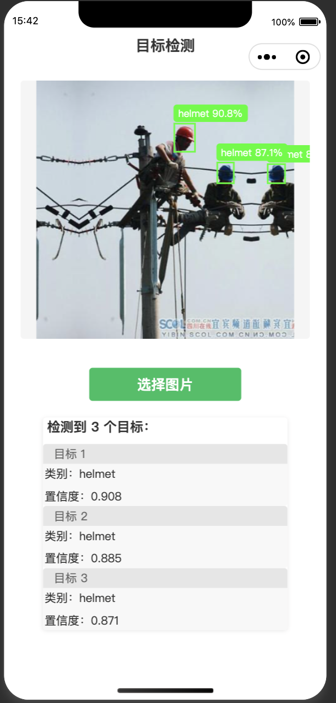

# miniprogram_yolo
A simple example of calling the Yolo object detection model on a WeChat applet, based on FLASK.

# Run
## 1. Run Flask services
```shell
python flask_yolo.py
```
## 2. Run miniprogram with `微信开发者工具`


